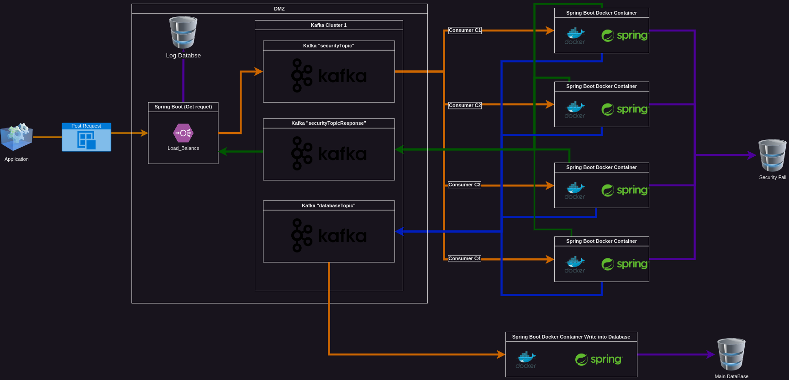

# Learning Spring Batch

------------------------------

## Introduction

This is a side project that I was working on while I was looking for a job. I wanted to sharpen my programming and designing skills.

I wanted to learn Kafka, Java JDBC and clean coding for this project.

--------------------------------

## Overview design

<figure><figcaption>Design overview</figcaption></figure>

-------------------------

## MainApplication

The main application will get an extra amount of data constantly. The role of the main application is to break the data into multiple chunks and send it to each topic via Kafka. Kafka uses a Request-Response pattern to make the main application a consumer and a producer. The main application sends streams on the "securityTopic" and will get a response from the "securityTopicResponse". The main application uses a Rest API that can communicate via endpoints. Moreover, the application will write a log in the "Log Database" for security and debugging reasons. This system part can act as a canary/honey pot server. 

----------------------------------------------

## CheckingForSQLInjections

Those microservices listed on the "security topic" use multithreading and will allocate responses dynamically based on the available reactions. The microservices use some custom SQL injection prevention methods to check the integrity of the data. If the data is okay, then it will send it to "databaseTopic", or it will send it to the "Security Fail" database, and it will send a custom code to the "databaseTopic" to stop the process since the data is it treated as one piece.

-----------------------------

## DataBaseMicroservice

The microservice listens to the "database topic" and will check the codes that the "CheckingForSQLInjections" microservices have set for each stream. Depending on the code, the microservice will act upon each stream. The microservice will drop the entire process if it sends a code above a certain level.

-------------------------

## Design patterns

### Factory design pattern

When the data is sent to the "security topic", it will be checked, and if it passes the checking part, it will create the objects stored in the database. Moreover, all the objects will be allocated to their code since the codes are treated differently.

### Observer arhitectural design pattern

The observer architecture is in the "CheckingForSQLInjections" microservice and "DataBaseMicroservice". If a malicious element has been found in one of the chunks, then the entire work is stopped in the "CheckingForSQLInjections" microservice, and only a bad code will be sent to the "DataBaseMicroservice" microservice, optimizing the time and the memory complexity. On the other hand, the "DataBaseMicroservice" will wait to see all the chunk's integrity and start its process.

### Request-Response design

The request-response is used between the "MainApplication" and the "CheckingForSQLInjections" since, one topic is used for requests and one topic is used for the reponse.

### Singleton desing pattern

Since the Spring Boot is the used framework the components (Beans) are used in a sigleton desing pattern, for reusability and memory optimisation.

### DAO Design Pattern

Since all the applications are writing in a Database then all of them are using DAO(Data Access Object) design pattern to decouple the data persistence logic to a separate layer.

### Dependency Injection Pattern

Since Spring Boot it is the used Framework the dependency injections is parttern is by default, because Spring Boot is built on the principle of dependency injection.

### N tier architecture

The arhitecture of the aplication can be devided into three main components:

* Presentation: the application that will send data to the "MainApplication"

* Buisness Logic: "CheckingForSQLInjections" microservice, and a small part of the "DataBaseMicroservice"

* Data/Resources: The "DataBaseMicroservice" and the "Main Database"

---------------------

## Performance

The performance of the system is impressive, the entire process takes 0.5 seconds. 

System specifications:

<table>

<tr>
    <th>Processor</th>
    <td>AMD Ryzen 7 4800H with Radeon Graphics 2.90 GHz</td>
</tr>
<tr>
    <th>GPU</th>
    <td>NVIDIA GeForce GTX 1650</td>
</tr>
<tr>
    <th>RAM</th>
    <td>16.0 GB DDR4</td>
</tr>
<tr>
    <th>SSD</th>
    <td>512GB PCIE G3</td>
</tr>

</table>
